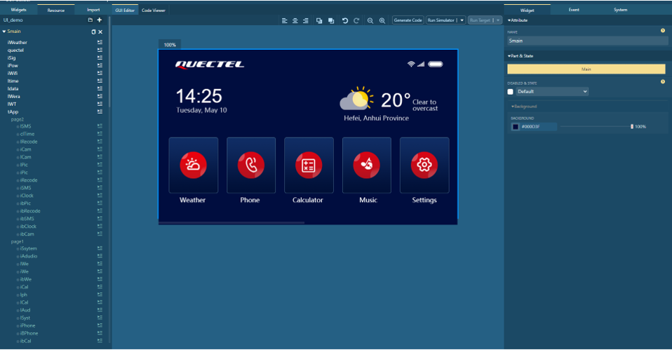

# Smart Agriculture Central Control Panel Solution for QuecPython

[中文](README_ZH.MD) | English

Welcome to the Smart Agriculture Central Control Panel Solution repository for QuecPython! This repository provides a comprehensive solution for developing smart agriculture central control panel applications using QuecPython.

## Table of Contents

- [Introduction](#introduction)
- [Features](#features)
- [Getting Started](#getting-started)
  - [Prerequisites](#prerequisites)
  - [Installation](#installation)
  - [Running the Application](#running-the-application)
- [Directory Structure](#directory-structure)
- [Usage](#usage)
- [Contribution](#contribution)
- [License](#license)
- [Support](#support)

## Introduction

[QuecPython](https://python.quectel.com/en) has introduced a GUI solution for a [Smart Agriculture Central Control Panel](https://github.com/QuecPython/solution-Agriculture-Control-Panel.git) based on the [U-235 Development Board](https://images.quectel.com/python/sites/2/2023/08/Quectel_QuecPython_U-235_EVB_User_Guide_V1.0.pdf). The features include weather forecast, agricultural environmental data  monitoring, real-time data display, historical data curves, agricultural equipment control, alarm and fault event notifications, system  settings, and more.


The U-235 development board comes with the default onboard EC600U module and an externally connected 5-inch screen with a MIPI interface and a  resolution of 854*480. Additionally, it features a variety of sensors  and peripheral interfaces onboard. For more details, you can refer to  the [U-235 EVB User Guide](https://images.quectel.com/python/sites/2/2023/08/Quectel_QuecPython_U-235_EVB_User_Guide_V1.0.pdf).


The Smart Agriculture Central Control Panel uses [LVGL](https://lvgl.io/) to draw the graphical interface. LVGL is a lightweight, open-source  embedded graphics library. QuecPython integrates LVGL and utilizes NXP's [GUI Guider](https://www.nxp.com/design/software/development-software/gui-guider:GUI-GUIDER) as a graphical interface design tool. It can automatically generate  QuecPython code, significantly improving the efficiency of graphical interface design on embedded platforms.



## Features

- **Environmental Data Display**: Provides real-time data for various environmental parameters in agriculture.
- **Device Status Display**: Used to monitor and display the operational status of various devices and sensors.
- **System Settings**: A crucial part of user configuration and personalization for their agricultural management system.
- **Device Control**: A crucial component for managing and operating various farm equipment.
- **Parameter Settings**: Allows users to customize and adjust various environmental and equipment operation parameters.

## Getting Started

### Prerequisites

Before you begin, ensure you have the following prerequisites:

- **Hardware**:
  - A QuecPython U-235 development board
  - USB Data Cable (USB-A to USB-C)
  - PC (Windows 7, Windows 10, or Windows 11)

- **Software**:
  - USB driver for the QuecPython module
  - QPYcom debugging tool
  - QuecPython firmware and related software resources
  - Python text editor (e.g., [VSCode](https://code.visualstudio.com/), [Pycharm](https://www.jetbrains.com/pycharm/download/))

### Installation

1. **Clone the Repository**:
   ```bash
   git clone https://github.com/QuecPython/solution-Agriculture-Control-Panel.git
   cd solution-Agriculture-Control-Panel
   ```

2. **Flash the Firmware**:

   Follow the [instructions](https://python.quectel.com/doc/Application_guide/en/dev-tools/QPYcom/qpycom-dw.html#Download-Firmware) to flash the firmware to the development board.

### Running the Application

1. **Connect the Hardware**:
   - Insert the SIM card into the SIM card slot.
   - Connect the antenna.
   - Use a USB data cable to connect the development board to the computer's USB port.

2. **Download Code to the Device**:
   - Launch the QPYcom debugging tool.
   - Connect the data cable to the computer.
   - Press the **PWRKEY** button on the development board to start the device.
   - Follow the [instructions](https://python.quectel.com/doc/Application_guide/en/dev-tools/QPYcom/qpycom-dw.html#Download-Script) to import all files within the `code` folder into the module's file system, preserving the directory structure.

3. **Run the Application**:
   - Select the `File` tab.
   - Select the `main.py` script.
   - Right-click and select `Run` or use the run shortcut button to execute the script.

## Directory Structure

```plaintext
solution-Agriculture-Control-Panel/
├── code/
│   ├── about_screen.py
│   ├── Agri_ui.py
│   ├── alarm_screen.py
│   ├── dev1_screen.py
│   ├── dev2_screen.py
│   ├── EventMesh.py
│   ├── img/
│   │   ├── mp-1092957702.png
│   │   ├── mp1105200495.png
│   │   ├── (Some pictures are omitted here)
│   │   └── mp996516799.png
│   ├── main.py
│   ├── main_screen.py
│   ├── monitor_screen.py
│   ├── screen.py
│   ├── setting1_screen.py
│   ├── setting2_screen.py
│   ├── weather_screen.py
│   └── welcome_screen.py
├── docs/
│   ├── en/
│   │   └── media/
│   │       ├── Agriculture-Control-Panel.png
│   │       ├── GUI-Guider.png
│   │       └── U235-EVB.png
│   └── zh/
│       └── media/
│           ├── Agriculture-Control-Panel.png
│           ├── GUI-Guider.png
│           └── U235-EVB.png
├── LICENSE
├── README.MD
└── README_ZH.MD
```

## Usage

[Click](https://python.quectel.com/doc/Application_guide/en/solutions/Agriculture-Control-Panel/index.html) for details of the smart agriculture central control panel solution's implementation.

## Contribution

We welcome contributions to improve this project! Please follow these steps to contribute:

1. Fork the repository.
2. Create a new branch (`git checkout -b feature/your-feature`).
3. Commit your changes (`git commit -m 'Add your feature'`).
4. Push to the branch (`git push origin feature/your-feature`).
5. Open a Pull Request.

## License

This project is licensed under the Apache License. See the [LICENSE](LICENSE) file for details.

## Support

If you have any questions or need support, please refer to the [QuecPython documentation](https://python.quectel.com/doc/en) or open an issue in this repository.