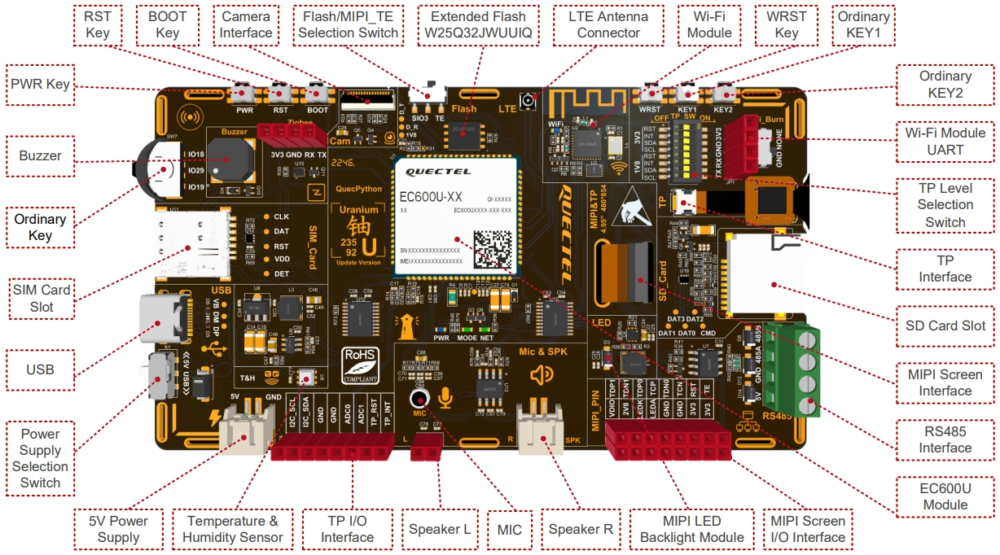
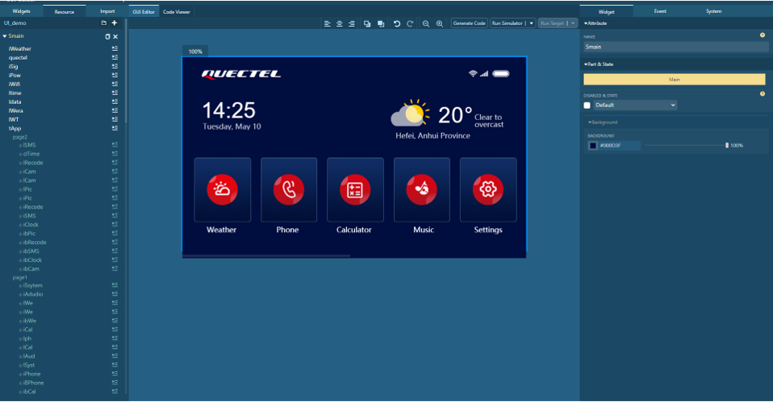

# QuecPython 智慧农业中控面板

中文 | [English](README.MD)

欢迎来到 QuecPython 智慧农业中控面板解决方案仓库！本仓库提供了一个全面的解决方案，用于使用 QuecPython 开发智慧农业中控面板应用程序。

## 目录

- [介绍](#介绍)
- [功能](#功能)
- [快速开始](#快速开始)
  - [先决条件](#先决条件)
  - [安装](#安装)
  - [运行应用程序](#运行应用程序)
- [目录结构](#目录结构)
- [使用](#使用)
- [贡献](#贡献)
- [许可证](#许可证)
- [支持](#支持)

## 介绍

[QuecPython](https://python.quectel.com/en) 基于 [U-235 开发板](https://images.quectel.com/python/sites/2/2023/08/Quectel_QuecPython_U-235_EVB_User_Guide_V1.0.pdf)推出了一款[智慧农业中控面板的 GUI 解决方案](https://github.com/QuecPython/solution-Agriculture-Control-Panel.git)，包括天气预报、农业环境数据监测、实时数据显示、历史数据曲线、农业设备控制、报警和故障事件提醒、系统设置等功能。


U-235 开发板默认板载 EC600U 模组，并外接一个 MIPI 接口的、分辨率为 480*854 的 5 寸屏幕，同时板载丰富的传感器和外设接口，详情可查看 [U-235 开发板说明文档](https://images.quectel.com/python/sites/2/2023/08/Quectel_QuecPython_U-235_EVB_User_Guide_V1.0.pdf)。



智慧农业中控面板使用 [LVGL](https://lvgl.io/) 绘制图形化界面，它是一个轻量级的、开源的嵌入式图形库。QuecPython 集成了 LVGL，并且使用 NXP 公司的 [GUI Guider](https://www.nxp.com/design/software/development-software/gui-guider:GUI-GUIDER) 作为图形化界面设计工具，能自动生成 QuecPython 代码，极大提高了嵌入式平台图形化界面设计的效率。



## 功能

- **环境数据显示**: 提供了农业中的各种环境参数的实时数据。
- **设备状态显示**: 用于监测和显示各个设备和传感器的运行状态。
- **系统设置**: 用户配置和个性化其农业管理系统的关键部分，允许用户调整各种系统参数以满足特定的需求和偏好。
- **设备控制**: 用于管理和操作农场各种设备的关键部分。
- **参数设置**: 参数设置界面允许用户自定义和调整各种环境和设备操作参数。

## 快速开始

### 先决条件

在开始之前，请确保您具备以下先决条件：

- **硬件**：
  - 一块 QuecPython U-235 开发板
  - USB 数据线（USB-A 转 USB-C）
  - 电脑（Windows 7、Windows 10 或 Windows 11）

- **软件**：
  - QuecPython 模块的 USB 驱动
  - QPYcom 调试工具
  - QuecPython 固件及相关软件资源
  - Python 文本编辑器（例如，[VSCode](https://code.visualstudio.com/)、[Pycharm](https://www.jetbrains.com/pycharm/download/)）

### 安装

1. **克隆仓库**：
   ```bash
   git clone https://github.com/QuecPython/solution-Agriculture-Control-Panel.git
   cd solution-Agriculture-Control-Panel
   ```

2. **烧录固件**：
   按照[说明](https://python.quectel.com/doc/Application_guide/zh/dev-tools/QPYcom/qpycom-dw.html#Download-Firmware)将固件烧录到开发板上。

### 运行应用程序

1. **连接硬件**：
   - 使用 USB 数据线将开发板连接到计算机的 USB 端口。

2. **将代码下载到设备**：
   - 启动 QPYcom 调试工具。
   - 将数据线连接到计算机。
   - 按下开发板上的 **PWRKEY** 按钮启动设备。
   - 按照[说明](https://python.quectel.com/doc/Application_guide/zh/dev-tools/QPYcom/qpycom-dw.html#Download-Script)将 `code` 文件夹中的所有文件导入到模块的文件系统中，保留目录结构。

3. **运行应用程序**：
   - 选择 `File` 选项卡。
   - 选择 `main.py` 脚本。
   - 右键单击并选择 `Run` 或使用`运行`快捷按钮执行脚本。

## 目录结构

```plaintext
solution-Agriculture-Control-Panel/
├── code/
│   ├── about_screen.py
│   ├── Agri_ui.py
│   ├── alarm_screen.py
│   ├── dev1_screen.py
│   ├── dev2_screen.py
│   ├── EventMesh.py
│   ├── img/
│   │   ├── mp-1092957702.png
│   │   ├── mp1105200495.png
│   │   ├── (Some pictures are omitted here)
│   │   └── mp996516799.png
│   ├── main.py
│   ├── main_screen.py
│   ├── monitor_screen.py
│   ├── screen.py
│   ├── setting1_screen.py
│   ├── setting2_screen.py
│   ├── weather_screen.py
│   └── welcome_screen.py
├── docs/
│   ├── en/
│   │   └── media/
│   │       ├── Agriculture-Control-Panel.png
│   │       ├── GUI-Guider.png
│   │       └── U235-EVB.png
│   └── zh/
│       └── media/
│           ├── Agriculture-Control-Panel.png
│           ├── GUI-Guider.png
│           └── U235-EVB.png
├── LICENSE
├── README.MD
└── README_ZH.MD
```

## 使用

点击[这里](https://python.quectel.com/doc/Application_guide/zh/solutions/Agriculture-Control-Panel/index.html)查看智慧农业中控面板解决方案的详细实现。

## 贡献

我们欢迎对本项目的改进做出贡献！请按照以下步骤进行贡献：

1. Fork 此仓库。
2. 创建一个新分支（`git checkout -b feature/your-feature`）。
3. 提交您的更改（`git commit -m 'Add your feature'`）。
4. 推送到分支（`git push origin feature/your-feature`）。
5. 打开一个 Pull Request。

## 许可证

本项目使用 Apache 许可证。详细信息请参阅 [LICENSE](LICENSE) 文件。

## 支持

如果您有任何问题或需要支持，请参阅 [QuecPython 文档](https://python.quectel.com/doc) 或在本仓库中打开一个 issue。